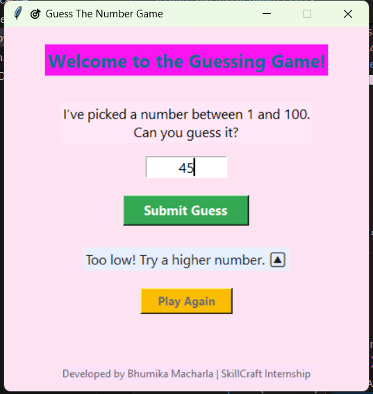
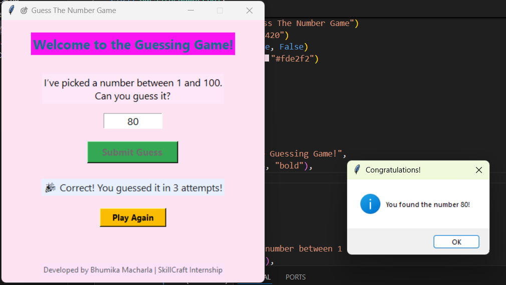

# 🎯 Guess The Number Game

A fun and interactive Python game built using **Tkinter** as part of my **SkillCraft Technology Internship**.  
The goal is simple — guess the random number between **1 and 100** and see how many attempts it takes!

---

## 🧠 Features
- 🎲 Random number generation  
- 🧩 Clean, minimal Tkinter GUI  
- 💬 Real-time feedback for each guess  
- 🔁 Replay option after a correct guess  
- ⚠️ Input validation and message pop-ups  

---

## 🗂️ Project Structure

guess-the-number/
│
├── main.py          # Entry point for the program
├── gui.py           # GUI (Tkinter frontend)
├── game_logic.py    # Backend logic for number generation
└── README.md        # Documentation


---

## 🚀 How to Run

1. **Install Python** (3.10 or above recommended)
2. Clone this repository:
   ```bash
   git clone https://github.com/your-username/guess-the-number.git
   cd guess-the-number
   ```
3. Run the game:
   ```bash
   python main.py
   ```

---

## 🎮 Gameplay
1. The program picks a random number between 1 and 100.  
2. You enter your guess and click **Submit Guess**.  
3. The game tells you if your guess is **too high**, **too low**, or **correct**.  
4. When you win, click **Play Again** to restart the game.

---

## 🎨 Screenshot

<p align="center">
  
</p>
<p align="center">
  
</p>
---

## 👩‍💻 Developer
**Bhumika Macharla**  
SkillCraft Technology Internship  
✨ *Learning, Building, and Growing with Python!*# guess-the-number
